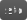

# Common attributes standardisation proposal

Draft 1

## Table of contents

1. [Motivation](#motivation)
1. [Standard Attribute Names](#standard-attribute-names)
   1. [Renderer Infos](#renderer-infos)
   1. [Camera](#camera)
   1. [Geometry](#geometry)
      1. [Geometric quantities](#geometric-quantities)
      1. [Identifiers](#identifiers)
      1. [classifications](#classifications)
    1. [Rendering](#rendering)

## Motivation

OSL has been tremendously successful at standardising shading but there are still non standardised areas, especially around each renderer’s internal nomenclature.
Although the same compiled shaders can run in any renderer, it is difficult in 2024 to write a shader that performs correctly in multiple renderers because each renderer names primitive attributes differently and may return some quantities in different spaces.

For example, if you wish to use the surface tangent:

| Renderer | OSL call |
| -: | :- |
| RenderMan | `getattribute("builtin", "Tn", tangent)` |
| Arnold | `Vector tangent = normalize(dPdu)` |
| Vray | `Vector tangent = normalize(dPdu)` |
| Cycles | `getattribute("geom:tangent", tangent)` |
| RedShift | `Vector tangent = normalize(dPdu)` |
| 3Delight | `Vector tangent = normalize(Dx(uvSet))`[^1] |

[^1]: u,v are parametric, so dPdu and dPdv won't be smooth on meshes: need a uv set and compute its derivative.

In this case, the shader writer hopes that u, v is not the parametric uv on meshes, otherwise dPdu may be non-smooth and pretty useless. But there is no guarantee.

> [!NOTE]
> In the spec, `u` and `v` are *"The 2D parametric coordinates of P (on the particular geometric primitive you are shading)"*. When `dPdu` is usable, it means the renderer is computing `dPds`/`dPdt` instead of `dPdu`/`dPdv`, and straying from the spec.

## Standard attribute names

Here is a list of proposed names for common attributes, inspired by various sources. Of course, some of these attributes should be computed on-demand, if possible.

### Renderer Infos

Shader writers have no way to tell which renderer is executing our code. I think this would be useful as there are other types of discrepancies that need to be taken care of by shader writers, like the space in which some attributes are returned or the meaning of uv (face or mesh-wide coordinates ?).

This could be fixed by adding 2 standard attributes.

| Attribute | Type | Description | |
| - | - | - | - |
| `"osl:version"` | int | `Major*10000 + Minor*100 + patch`. |  |
| `"shader:shadername"` | string | Name of the shader master. |  |
| `"shader:layername"` | string | Name of the layer instance. |  |
| `"shader:groupname"` | string | Name of the shader group. |  |
| `"renderer:name"` | string | lower-case name i.e. `"renderman"` |  |
| `"renderer:version"` | int | `Major*10000 + Minor*100 + patch`. |  |

### Camera

These attributes are already defined in the OSL standard, so this is just for completeness.

| Name | Type | Description | |
| - | - | - | - |
| `"camera:resolution"` | int[2] | Image resolution. |  |
| `"camera:pixelaspect"` | float | Pixel aspect ratio. |  |
| `"camera:projection"` | string | Projection type (e.g., "perspective", "orthographic", etc.) |  |
| `"camera:fov"`  | float | Field of fiew. |  |
| `"camera:clip_near"`  | float | Near clip distance. |  |
| `"camera:clip_far"`  | float | Far clip distance. |  |
| `"camera:clip"`  | float[2] | Near and far clip distances. |  |
| `"camera:shutter_open"`  | float | Shutter open time. |  |
| `"camera:shutter_close"`  | float | Shutter close time. |  |
| `"camera:shutter"`  | float[2] | Shutter open and close times. |  |
| `"camera:screen_window"` | float[4] | Screen window (xmin, ymin, xmax, ymax). |  |

### Geometry

> [!NOTE]
> We should also standardize the space in which geometric quantities are returned. It should **ALWAYS** be `"common"`.

#### Geometric Quantities

| Attribute | Type | Description | |
| - | - | - | - |
| `"geom:tangent"` | vector | The normalised surface tangent [^1][^2]. |  |
| `"geom:undisplaced_P"` | point | The surface position before displacement. |  |
| `"geom:undisplaced_N"` | normal | The surface normal before displacement. |  |
| `"geom:reference_P"` | normal | The surface position in reference pose in object space. |  |
| `"geom:reference_N"` | normal | The surface normal in reference pose in object space. |  |
| `"geom:reference_WP"` | normal | The surface position in reference pose in world space. |  |
| `"geom:reference_WN"` | normal | The surface normal in reference pose in world space. |  |

[^1]: Should always return a usable vector, even if there is no explicit surface parameterization, i.e. no UVs on a mesh.
[^2]: I didn't define a bitangent attribute, as it is easily computed with N and T.

#### Identifiers

| Attribute | Type | Description | |
| - | - | - | - |
| `"geom:id"` | int | A unique object id, or first part of 64 bits id. |  |
| `"geom:id2"` | int | The second part of a 64 bits unique object id. |  |
| `"geom:instance_id"` | int | A unique object instance id. |  |
| `"geom:curve_id"` | int | A unique curve id. |  |
| `"geom:point_id"` | int | A unique point id. |  |

#### classifications

| Attribute | Type | Description | |
| - | - | - | - |
| `"geom:is_mesh"` | int | 1 if object is a mesh, 0 otherwise |  |
| `"geom:is_subdiv"` | int | 1 if object is a subdivision surface, 0 otherwise |  |
| `"geom:is_curve"` | int | 1 if object is a curve, 0 otherwise |  |
| `"geom:is_point"` | int | 1 if object is a point, 0 otherwise |  |
| `"geom:is_volume"` | int | 1 if object is a point, 0 otherwise |  |

### Rendering

| Attribute | Type | Description | |
| - | - | - | - |
| `"stage:displace"` | int | 1 if running in displacement context, 0 otherwise. |  |
| `"stage:shade"` | int | 1 if running in shading context, 0 otherwise. |  |
| `"hit:direct"` | int | 1 if running on a direct ray hit, 0 otherwise. |  |
| `"hit:indirect"` | int | 1 if running on an indirect ray hit, 0 otherwise. |  |
| `"hit:roughness"` | int | The incoming ray's spread, with [0:1] range. |  |
